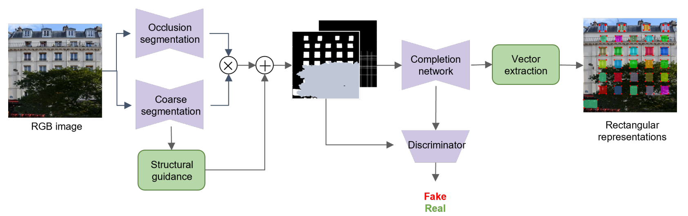
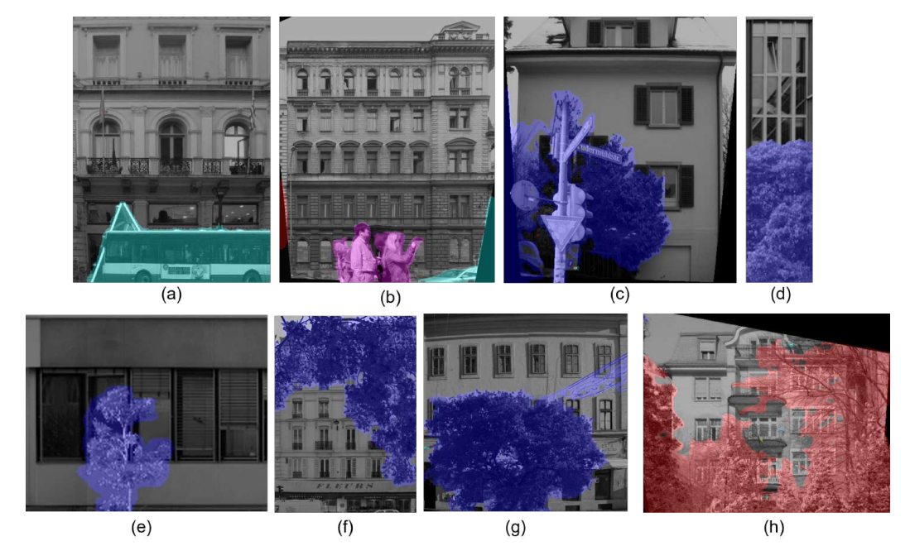
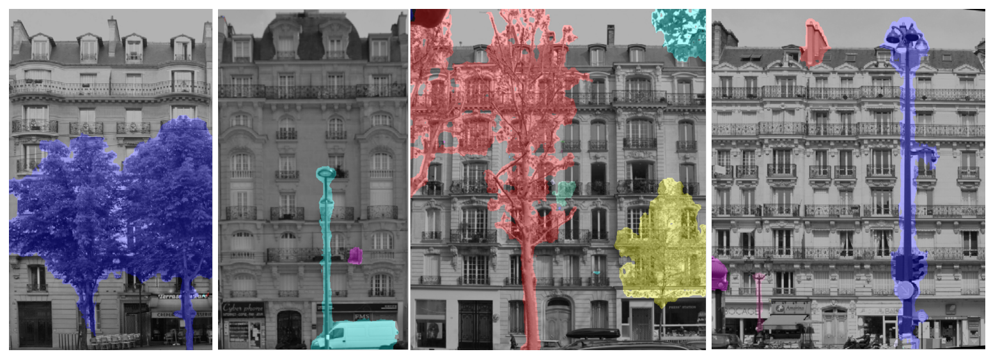
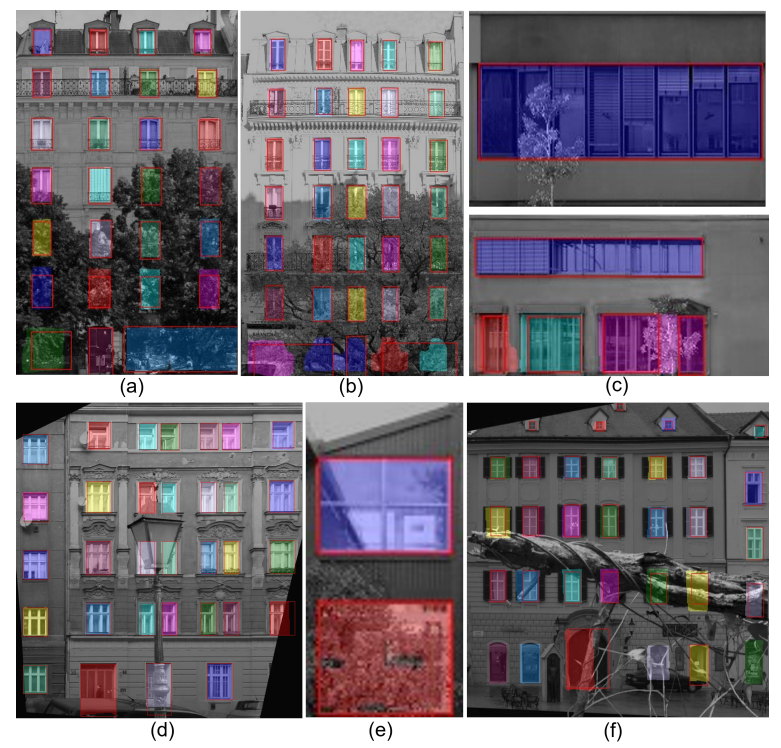
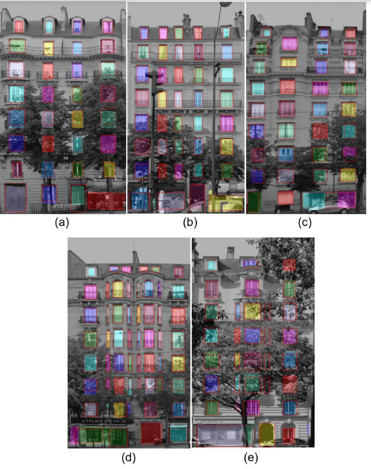

# OA-WinSeg
Occlusion-Aware window segmentation with conditional adversarial training guided by structural prior information

OA-WinSeg is composed of three main blocks:
1. Occlusion segmentation
2. Coarse window segmentation
3. Window completion network

 
*OA-WinSeg framework.*

## Dataset preparation

Before training or testing any model, generate .txt files with the current dataset:

1. Run *OA-WinSeg/data/write_file_list.py* to create train, val and test files, eg:
   ```bash
     python write_file_list.py -d full-occ60 -n data_name_full_occ60 -s train
   ```
To add a new dataset, input the path where the dataset is located in the variable *src_path*

## Train Occlusion segmentation model

1. Set parameters in *config-SegFormer.yaml* file
   - mode: test or train
2. Run *train_Segformer.py*
3. To test the model, add checkpoint_inference to *config-SegFormer.yaml* file with the path of the model to test, eg. "/home/cero_ma/MCV/code220419_windows/0401_files/SegFormer_full-occ60/200valiou_best.pth"

## Train Coarse window segmentation model

1. Set parameters in *config.yaml* file
   - model_name: name of backbone architecture, eg. ResUNet101
   - model_expresion: folder name of the current train/test model eg. artdeco_training
   - dataset: .txt file name containing dataset list eg. artdeco_ref, full-occ60
   - use-occ-model: False (do not use occlusion model)
   - use-coarse-model: False (do not use coarse segm. model)
   - adversarial: False (do not use adversarial training)
   - inp_model: None (no completion model)

2. Run *train.py*"
3. To test the model, add main_model_inference to *config.yaml* file with the name of the model to test, eg. '60valiou_best.pth' located at 0401_files/Res_UNet_101_full-occ80/pth_Res_UNet_101/60valiou_best.pth

The code supports the following backbone included in the folder */networks*: DeepLbav3+, PSPNet, Swin_Unet, Unet, Unet with ResNet encoder, TransUnet.

## Train Window completion network

1. Set parameters in config.yaml file
   - model_name: OA-WinSeg name of completion architecture
   - model_experision: folder name of the current train/test model eg. artdeco_training
   - dataset: txt file name containing dataset list eg. artdeco_ref, full-occ60
   - use-occ-model: True (use occlusion model)
   - use-coarse-model: True (use coarse segm. model)
   - adversarial: True (use adversarial training)
   - 1D_kernel: size of the 1D kernel for completion network, eg. 7
 
2. Set path of trained occlusion models to use for completion network:
   Eg.
   - ecp_occ_model: occlusion model of ecp occluded dataset
   - full_occ60_occ_model: occlusion model of occluded full dataset (ecp+cmp+graz50)

3. Set path of trained coarse model to use for completion network:
   Eg.
    - ecp_coarse_model: coarse segm. model of ecp occluded dataset
    - full_occ60_coarse_model:  coarse segm. model of 60% occluded full dataset (ecp+cmp+graz50)
    - artdeco_ori_coarse_model: coarse segm. model of artdeco original dataset
    - artdeco_ref_coarse_model: coarse segm. model of artdeco refined dataset
    - modern_coarse_model: coarse segm. model of 100% occluded modern dataset
    - full_occ100_coarse_model: coarse segm. model of 100% occluded full dataset (ecp+cmp+graz50) 
    - full_occ80_coarse_model: coarse segm. model of 80% occluded full dataset (ecp+cmp+graz50)

4. Run *train.py*

5. To test the model, add main_model_inference to *config.yaml* file with the name of the model to test, eg. '60valiou_best.pth' located at 0401_files/OA-WinSeg_full-occ80/pth_OA-WinSeg/60valiou_best.pth

## Resume training:
- resume_ckpt: False or path of model to resume training
- resume_ckpt_Discr: False or path of discriminator model to resume training

## Experimental results
For the experimental results, both dataset with simulated [*façade-occ*](https://github.com/manuelaceron/occ-data-generation) and real occlusions [*Paris Art Deco*](https://github.com/raghudeep/ParisArtDecoFacadesDataset) were tested.

### Occlusion detection on simulated dataset
The module is able to identify synthetic occlusions in *façade-occ* dataset, such as the examples presented in images (a) to (g); additionally, it shows some degree of generalization to real objects, as is the case of (real) vegetation in images (c) and (h).


### Occlusion detection on real dataset
Paris Art Deco dataset does not deliver occlusion annotations, therefore, we our trained model on *façade-occ* to run automatic occlusion detection on this evaluation dataset. 


### Window segmentation on simulated dataset
Some results of our OA-WinSeg method on *façade-occ* dataset are shown, including dense and sparse occlusions, partially or fully occluding façade windows. Color-coded segments represent OA-WinSeg predictions, while red boundaries indicate ground truth.


### Window segmentation on real dataset
Some results of OA-WinSeg in Paris Art Deco evaluation split are displayed in following figure, the samples mainly feature dense vegetation and small objects such as road signs, poles and cars. The images demonstrate the model’s ability to estimate occluded windows closely aligned with the ground truth.


